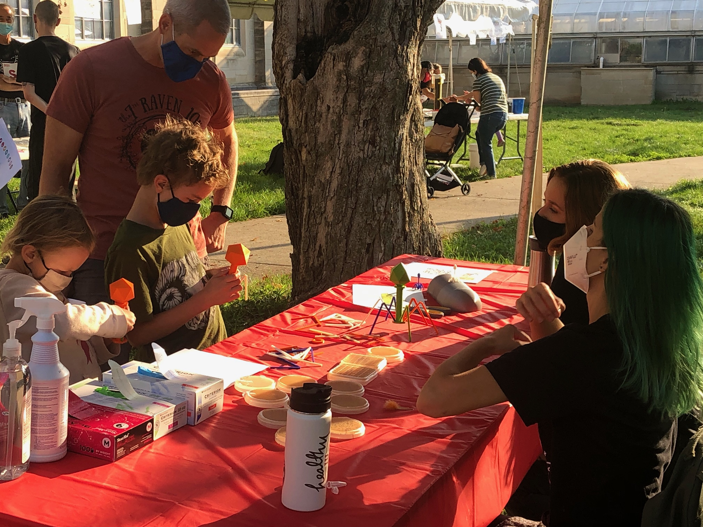

This year I participated in [Science Fest](https://scienceoutreach.indiana.edu/news-events/science-fest/index.html) at IU. It is a public event to encourage tne Bloomington community to come on campus and learn about research. Lennon Lab has hosted a "Bacterial Viruses" table where we explained what a bacteriophage infection is with illustrations, 3D models and lab samples. 

