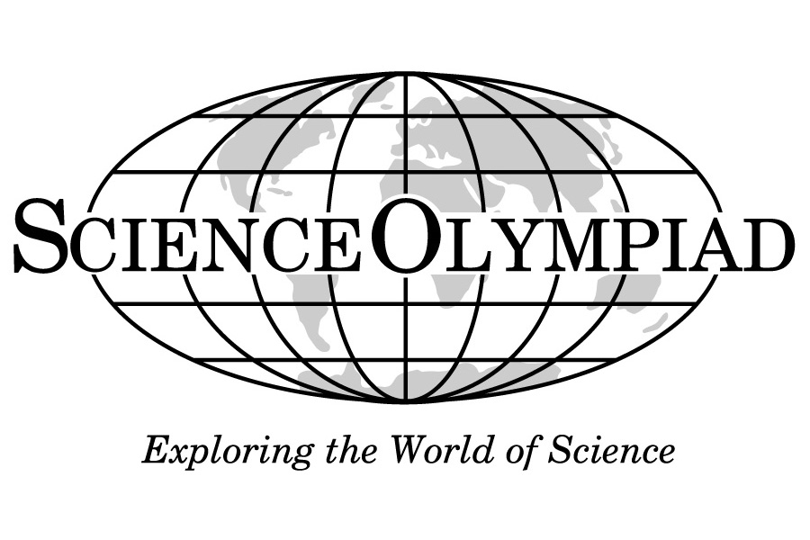

I am mentorig high school students for [Science Olympiad](https://www.soinc.org/) for Experimental Design section at the Bloomington South High School. Founded in 1984, Science Olympiad is the premier team STEM competition in the nation, providing standards-based challenges to 6000 teams at 425 tournaments in all 50 states.

