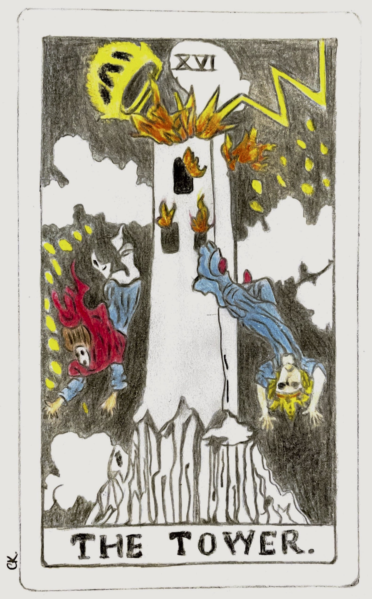

Yes, I am a scholar, but also a human. I have been through tough times too. I got my dream “everything” in life, but still managed to sabotage myself. I have been spending hours, days, weeks and months to get my spirituality back, find my peace, and to be a better human. This is the journal of my stupidities, lessons from them and late awareness, but, who knows, I will maybe save one person from eternal suffering. I will just write about my mistakes, what I feel and  what I learn in general. Often, I will not remember where I have got the ideas, because I have been reading and listening a lot, visiting Buddhist teachings, and practicing meditation. I have had many therapy sessions so far. I cannot give reference for everything I write, not all will be scientific too. So, if you are reading these, and get sparks in your head, better seek for help, before reading Freud :) 

We think that we respond to the situations with emotional reactions. But there is another step in between: Perception. 

We often have similar perceptions to different situations, which are simply patterns. Unfortunately, our brains cannot differentiate positive patterns from negative patterns. Some patterns are so deeply wired in our brains, so we believe that they are true, and how we react is our true selves. Sometimes we develop those patterns from childhood. Maybe our parents reacted the same way, or our past partners, advisers, and friends. We get angry in certain situations, and we think that this is us. Well, this is not us, that is our feelings, and feelings are not us.

I did not get this awareness with a light coming from my heart. I knew that there is something wrong, but I seek for help after a terrible heartbreak. Guess what my therapist said: “You are not insane, you are delusional”. Guess what I said: “Am I stupid that I have not realized this”. He said: “X percent people on earth realize after things get out of control”. What does it mean? It is self-sabotage. I am going to talk about it another time. 

So, if you are aware of your patterns, you can modify the perspective part of the reaction chain and choose how to respond. Of course, you will not be a better person after you realize what your negative patterns are. Your brain will trick you to go back to your old patterns. Why? First, if you are reading this, stop thinking that your mind is right. It just tries to protect you from danger. What is the first reaction would protect your lizard brain? Anger. 

“What gets fired gets wired”.

You must practice a lot to rewire your brain. One example: What would you do if it starts raining while you are trying to go somewhere? My old self would be extremely frustrated. Now I take a breath and think that I cannot control the wetter! Also, I am not goint to die if I get wet. I try to think about the life that rain gives to the nature. It is still science, friends, it is neuroplasticity, so believe me, you can change it in time. 

Take a deep breath. 

Feelings like fear, pain and suffering are states of mind. They are not real, we make them our reality. We solidify them in our brain, and ignore other possible realities. In other words, they are caused by the narratives that we create in our minds. If you create negative narratives, you will not be happy. Also, you cannot find happiness outside! If your patterns are negative, you cannot be happy whatever the external situation is. 

Listen yourself. Maybe you are also delusional, you have distorted perspectives on yourself, people around you. You think that you are not enough, you think that you will get sick and be miserable, you think that you will get fired for whatever reason. Delusions will crowd your mind, and your life will be filled with frustration. When things go wrong, you will try to correct the condition, not how you respond to it. You will create more problems to yourself and to others. Others will have the option to escape, but you cannot escape from yourself, and you will suffer more at the end. 

In short, do not be a puppet of your mind. You can stop creating unrealistic narratives or the worst-case scenarios in your head. If you are doing that, best way is to find a support to identify the patterns and reasons. Also, you cannot change the situations, but you can change your perspectives to them. 

