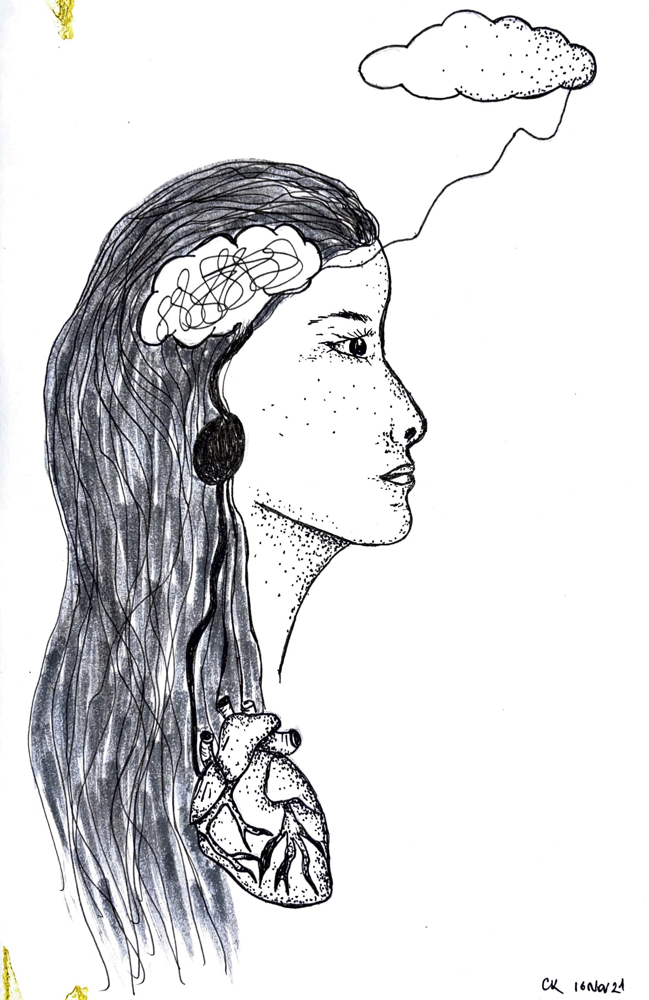

I think I will write a short one about today’s teaching to carve them to the digital stone and to my mind. 

When you are finally aware of your negative patterns, they do not magically disappear. You must replace them with positive ones. In the beginning, I impulsively did everything that I postponed or was afraid of. Run to the gym, impulsively socialized, impulsively spent money, did all the phone calls and official stuff that I feared, even got a tattoo. 
I am sticking to good routines, and they will eventually become good habits. 

However, the hardest part of the healing journey is to connect the heart, body, and mind. I was not thought this by my anxious parents or angry teachers. Therapies help, but you should really want to learn how to say no to your mind tricks permanently. Teachings and meditation help me to practice my negative state of mind which might be triggered again by certain situations or people. I think I will then be ready to transform my frustration and anger, then express my feelings with compassion. I say transform because we often suppress the beast inside of us for the sake of being kind. Maybe we punch our pillows or workout until we die, but the beast stays always there. We release the beast in some ways like blaming or criticizing others. 

Often nerves are fired too quickly, you do not understand it is coming, you hurt people and yourself. Apparently, there are multiple techniques to pause that moment such as leaving for some time or imagining yourself as a mahogany wood for that moment, to be able to think mindfully later. Again, that is different than suppression. It is about changing your perspective eventually, going to your heart, and thinking about other people might also have a negative state of mind. 

