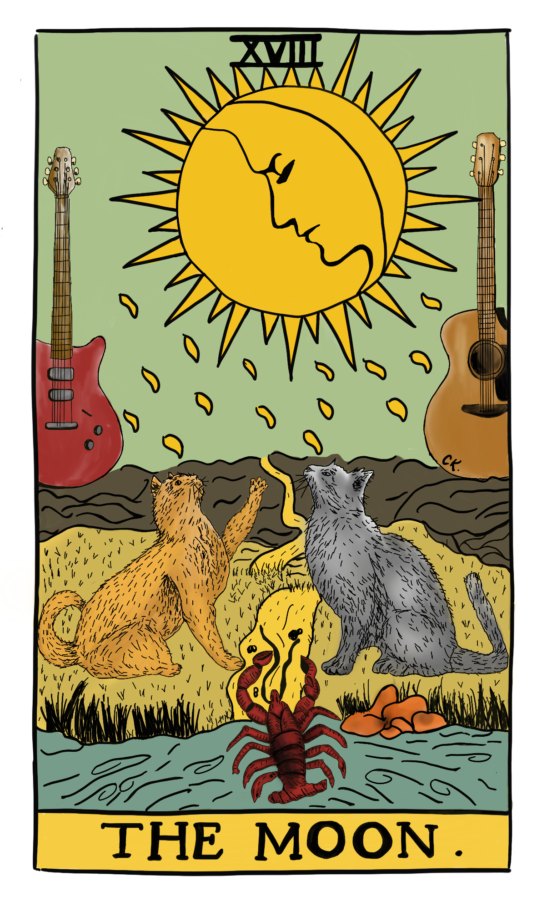

Fear has stopped me from doing many things I wanted to do. I believed that fear was my intuition until I learned that it was a stop signal of the sympathetic nervous system trying to protect me. It keeps me in my comfort zone, especially when I will do something that I have not done before. 

It is not always about big things like a career change, planning parenthood, or divorce. Your brain might stop you from doing simple things like trying a new sport, socializing, giving a presentation, or going to new places. Fear feels real; it is biology, evolution, and a physical experience with all senses that makes it difficult to identify. 

"Fear of the unknown".

If you are aware of it now, you can identify when you are afraid of something next time. My strategy was not to ignore it and try to understand where it came from. My therapist was asking me, "What would happen if you do X?". Half of my thoughts were irrational: Things might happen, but there was one in a million chance. Past traumas caused the other half. It helped me to think about the real reasons and let them slowly go. 

I am paraphrasing a technique that I have learned from somewhere: When you feel it, realize it and say, "Thank you for warning me about my body, but stop controlling me and let me do my stuff." If you step back, you can see other possibilities and find creative solutions. 

"Fight or flight".

Another technique I have learned is "take a deep breath": Four seconds inhale, eight seconds exhale. Breathing activates the parasympathetic system, which helps you deactivate the fight or flight response.

Also, friends, you do not live in the moment if you are afraid of something that might happen in the future, even though the probability is high. What you do is sabotage the joy and productivity at that moment. You also act according to that fearful scenario.
Of course, you should have some fear to keep you on track, but you should balance it. What I am saying is that do not be afraid of stupid things. 

"Just do it and stick to it," said my therapist.

I go and do after I face my fears and resolve where they come from. I have done so many things that I have postponed for so long or have not felt secure enough to start. I made new friends, got new hobbies, put myself out, set new goals, and I still have tons of energy to do more. If you work on your confidence, fearful thoughts come less and less every day, or they become easy to deal with. I will write about insecurities in the next post. 

"Invisible boundary" is Thoreau's terminology for fear. 

I am going to paraphrase my therapist again: "Do you have the intellectual capacity to manage to detox tomorrow? Enjoy that bucket of ice cream today!".
