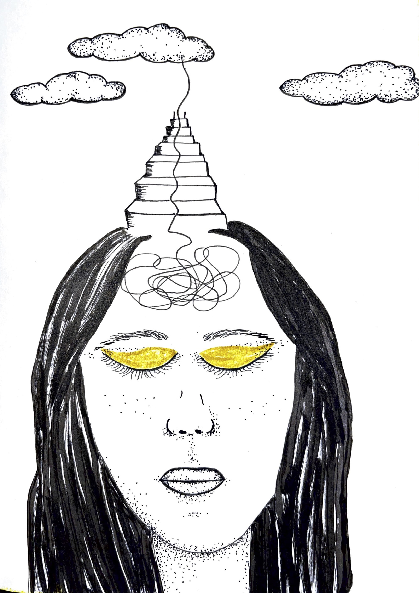

Spiritual awakening is waking up to a life with a feeling of being more present and alive, which is a necessary transformation towards becoming a better human being. People talk about the different stages of awakening. I am not quite sure about the clear cuts between them, and I think it is not quite a linear process. Also, I don’t know at what stage am I, but it feels like after some time you just surrender and there is no way out. Awakening can happen at any age, so you shouldn’t be harsh on yourself. You probably had to deal with life or did not know where to start. I have also had chances a couple of times in my life, but survival was more important at those times. I also haven’t had time for myself alone, nor resources, support, and wisdom to continue the awakening.

They call the first phase of awakening “the dark night of the soul”. For some, it is not necessarily after traumatic experiences. For me, it started after a traumatic life event. Everything I believed all my life has dissolved and disappeared. I think that I was already close to that dark place. I was detached from life and people around me. I was drowning in my negative patterns and ego. Traumas just fired the process. I didn’t want to hang out too long in the dark. I had the willingness and motivation to change and heal. This healing process led me to the spiritual path somehow. It took another couple of weeks to realize that I am on an awakening path. I was suffering, but it didn’t feel like depression as it sounds. I could still do things, even more than that. I’ve started working on my negative patterns, reevaluated my routines, and I was more social and productive. I had hope. It was a period of freedom, excitement, and joy along with a lot of pain and heartache. 

Everything felt more meaningful and meaningless at the same time.

So, you first feel detached from your life. You think that you are getting crazy. It is alienating and lonely in the beginning, but you need space and alone time to sit with your thoughts and reevaluate your existence. You want to take control of your life, happiness, and destiny. It feels like a painful internal war. It is miserable, but it guides you to find your true self and the meaning of life eventually. You start to realize the delusions introduced by society, your family and your DNA. They often use the Matrix analogy to describe these stages. You take the red pill and open your eyes to the new true world. You begin to look at your life and situations from a new perspective. 

All these changes happening in your mindset point that your thoughts, feelings, and emotions shape your reality. And, by channeling your mind in the right direction, you can change your belief systems. You start to be aware of your negative habits. You evaluate all your actions. You start not to blame anything and anyone anymore. You take full responsibility for your life. You forgive yourself, people, and the past. It is a lot of pain to find the roots of negative patterns because it involves parents, childhood traumas, and nasty experiences. This is not an overnight process and requires support. You must keep constantly spotting conflicted narratives and try to reframe harming thoughts. I think the moment you accept all that has happened and stop blaming everything, you are awakened. This is when you break your ego’s defense mechanism and a way to be a better human being. 

You develop a different relationship with nature. You even look at your local park or garden with different eyes. You see signs and connectedness everywhere. Since your perspective changes, you try to find meaning everywhere. You don’t look at things as coincidences anymore. I think it is because it is a scary transformation. It is like you’re alone in a dark forest, walking to the unknown. The first thing you try to find is a guide from your spirits. It sounds weird, but these hopes help you to focus on positive emotions such as love and gratitude. You may get interested in understanding more about spirituality and the role of metaphysics in life. 

You look at the world with wonder and curiosity.

These feelings are fired when you are trying to grow with support, community, psychology books, podcasts, talks and so on. You’re slowly exposed to some sort of practical spirituality. That energy attracts more information and people that you can talk about spirituality and consciousness. By the way, it is not divine intervention. Spirituality is a proven stress management tool, there is no way you get into this if you are motivated to heal find and your real self.  

Friends, if you’re healing from traumas, you won’t jump through stages and see the light overnight. You’ll find yourself in the dark several times. Only thing is to stand up and keep going. Old you will resist and try to bring you back, but new you is waiting to be born. You’ll talk to yourself all day every day. You’ll realize that you’re not alone, but a part of the universe. You’ll love yourself and everyone and everything. These are the topics of the next post about stages.

