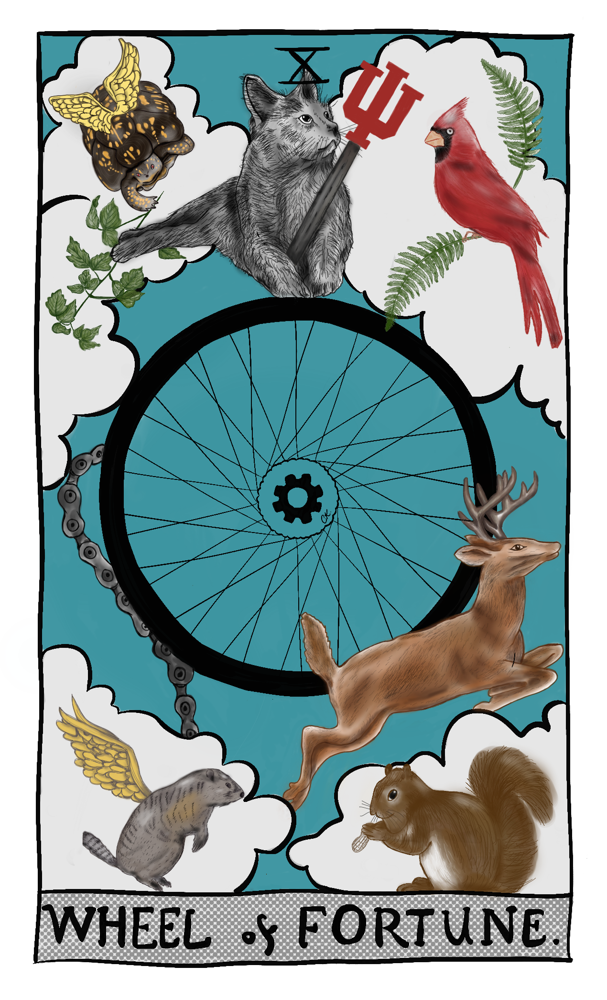

Although I have just started practicing this, and I decided to write about it sometime later, yesterday, a friend and I had a real near-death experience. This is the right time to write. 

First, I am grateful that I am just injured and still alive to write these lines. 

Before that unfortunate accident happened, I listed things we're grateful for. The sound of water, trees, fossils that I found, birds by the lake, and a friend unconditionally supported my fight with anxiety and grief. 

My low self was talking to me after the injury, saying, “You are a loser.” I knew then that it was a trick of my mind again. I knew that I would suffer if I fell into that trap. 

What if I had not been able to thank people and the little joys I have had in this life? My body, legs, arms, and eyes that I could go and do things, draw, write, read, learn, create, and love. I could have pets, plants, and maybe kids in the house. People, nature, and animals could help. It was a blessing, not an unfortunate event. 

How many of you have ever had something taken away from you in your life, and you only realized how much you appreciated it afterward? I know it is not easy to be grateful after bad things happen. We lose things, health, or people permanently, or we no longer have contact with them. I was never thankful in the beginning. It was always the worst thing that had ever happened to me. I always felt weak, worthless, and miserable. 

Forgiveness is another topic, but the key is forgiving yourself, anything, or anyone that made you sad. Whatever happened is for a reason. Cry your heart out, collect your pieces, ask for help, and be grateful for the million other things left. Take your pain to transmute it to strength, abundance, and productivity. And be grateful for that. Be grateful for the social competence, creativity, problem-solving ability, autonomy, empathy, and forgiveness you learned during the grief. That is the victory; it is a real soul detox and a resilience test, believe me. 

I am grateful for what I gained, not what I lost. 

I could never feel gratitude in my heart and practice it in real life. It would have taken years to work on my negative patterns. Now, I feel more grounded, resilient, and focused on the moment than ever. I am grateful that I have experienced millions of tiny joys, nevertheless.  

You make sense of the past, bring your attention to today, and improve your vision for the future. 

Sometimes, I struggled to find a reason to get out of bed, have a coffee, get my book, laptop, or bag, and go out. I could have been less frustrated if I had stopped for five minutes, listened to my heart, and verbalized only one thing I was grateful for. Now, I look and find things everywhere that I am grateful for. At least I am grateful for another day.

I knew about gratitude. I assume that we learn in kindergarten. But I was not feeling it so I could extend and exercise it. If one thing goes bad daily, thousands of things go right, but our brains are wired to see the negative things. Because the world we live in is negative. Our parents, teachers, and society constantly criticize us. I was too busy comparing myself with others or criticizing negative things, and I could not see what I had. Do not mix gratitude with recognition. Recognition is finite, and it has limits. You recognize something when the expectations are fulfilled. Appreciation is deeper than that. It is not for the product, but the feelings, for the people who they are. 

I took small things for granted.

Expectations block us from seeing small things. Sometimes, people do beautiful little things, and we just do not see them. We do not even realize that beautiful nature outside changes every day. Happiness is in our hearts, not outside. We believe that we will be happy when the situations change—when we get a better house, better job, or better partner. 

There is no reason to concentrate on what you do not have or envy others' lives. Be happy for others, too. If your brain is wondering about overwhelming work, money, future, family, laundry, dirty dishes, dinner, and so on, please bring it to the moment. Be grateful for the bed that was made, a cup of coffee, sun, legs, shoes, headphones, and podcasts you can listen to while walking. 

Focus on what you have, not what you do not have.

We do not always have to dig into our childhoods, find traumas, and try to resolve them. There is too much negativity going on there. I try to find positive things I am grateful for and tell my parents, friends, and colleagues. I write gratitude letters to the ones who are not there anymore. You do not need to share your gratitude. There are probably some people who passed away or walked away from your life. It turned out that there were too many positive things to be grateful for.

Unfortunately, old values do not change in a couple of months. But if you practice every day, they will be permanently written in your subconscious mind. Understanding is not enough; practice, tell people, and even write. Gratitude does not only unlock neuroplasticity and the chemicals and hormones released while practicing, it also improves physical well-being. It is not magic; studies show what changes happen in the brain after practicing gratitude for a couple of weeks. 

When I think about the things that I am grateful for, it does not only bring me joy, but I feel the power to spread it. “When you change yourself, you change the world”.

Gratitude also frees us from emotional pain. I used to think I did not deserve the things given to me. Instead of being grateful for them and feeling joyful, I found negative things to complain about. Gratitude replaces self-pity with joy. It shifts your attention from toxic emotions like resentment and envy. When you are constantly grateful to others and know how much others have blessed your life, ruminating on your negative experiences becomes harder. 

Also, accept the compliments and say thank you. They are genuine; do not cut yourselves down. It was crazy to learn that kindness increases serotonin levels in both ways.  

Finally, gratitude is like taking the moment and holding on to it. It means being grateful for a cup of coffee, thinking about how it comes to your kitchen, slowing down the moment, and feeling the acidity. 

