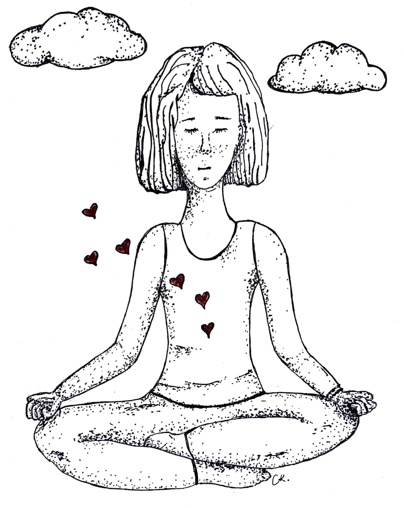

Although this is something that I have just started practicing, and decided to write about it sometime later, yesterday I and a friend had a real near-death experience. I think this is the right time to write. 

First, I am grateful that I am just injured and still alive, so I can write these lines. 

Before that unfortunate accident happened, I was indeed listing things that we're grateful for. Sound of water, trees, fossils that I found, birds by the lake, a friend unconditionally supports my fight with anxiety and grief. 

My low self was talking to me after the injury saying, “you are a loser”. I knew at that moment that it was a trick of my mind again. I knew that I would suffer if I fell into that trap. 

What if I would not have a chance to thank people and the little joys I have had in this life. My body, my legs, my arms, my eyes that I could go and do things, draw, write, read, learn, create, and love. The house I could have, pets, plants, and maybe kids. People, nature, and animals I possibly could help. It was a blessing, not an unfortunate event. 

How many of you have ever had something taken away from you in your life, and you only realized how much you appreciate it after? I know it is not easy to be grateful after bad things happen. We lose things, health, or people permanently, or we no longer have contact with them. I was never thankful in the beginning. It was always the worst thing that has ever happened to me. I always felt weak, worthless, and miserable. 

Forgiveness is another topic, but the key is to forgive yourself, anything or anyone that made you feel sad. Whatever happened is for a reason. Cry your heart out, collect your pieces, ask for help and be grateful for the million other things left. Take your pain to transmute it to strength, abundance, and productivity. And be grateful for that. Be grateful for the social competence, creativity, problem-solving ability, autonomy, empathy, and forgiveness that you have learned during the grief. That is the victory, it is a real soul detox, it is a resilience test, believe me. 

I am grateful for what I gained, not what I lost. 

I could have never felt in my heart and practiced gratitude in real. It would have taken years to work on my negative patterns. Now I feel more grounded, resilient, and focused on the moment than ever. I am grateful that I have had the experienced millions of tiny joys, nevertheless.  

You make sense of the past, bring your attention to today and improve your vision for the future. 

There were times that I struggled to find a reason to get out of bed, have a coffee, get my book, laptop, or bag, and go out. If I have stopped five minutes, listened to my heart, verbalize only one thing that I was grateful for, I could have been less frustrated. Now I look and find things everywhere that I am grateful for. At least I am grateful for another day.

I knew about gratitude. I assume that we learn in kindergarten. But I was not feeling it, so I could extend and exercise it. If one thing goes bad on a day, thousands of things go right, but our brains are wired to see the negative things. Because the world we live in is negative. We are criticized by our parents, teachers, and society constantly. I was too busy comparing myself with others or criticizing negative things that I could not see what I have. Do not mix gratitude with recognition. Recognition is finite, it has limits. You recognize something when the expectations are fulfilled. Appreciation is deeper than that. It is not for the product, but the feelings, for the people who they are. 

I took small things for granted.

Expectations block us from seeing small things. Sometimes people do beautiful little things, and we just do not see. We do not even realize beautiful nature outside changing every day. Happiness is in our heart, not outside. We believe that we will be happy when the situations change. When we get a better house, better job, better partner. 

There is no reason to concentrate on what you do not have or envy others' lives. Be happy for others too. If your brain is wondering about overwhelming work, money, future, family, laundry, dirty dishes, dinner, and so on, please bring it to the moment. Be grateful for the bed was made, a cup of coffee, sun, legs, shoes, headphones, and podcasts you can listen to while walking. 

Focus on what you have, not what you do not have.

I think we do not always have to dig into our childhood, find traumas and try to resolve them. It is too much negativity going on there. I try to find positive things that I am grateful for and tell my parents, friends, and colleagues. I write gratitude letters to the ones who are not there anymore. You do not need to share your gratitude. Probably some people who passed away or walked away from your life. It turned out that there are too many positive things to be grateful for.

Unfortunately, old values do not change in a couple of months. But if you practice every day, it will be written in your subconscious mind permanently. Understanding is not enough, practice, tell people and even write. Gratitude does not only unlock neuroplasticity, chemicals, and hormones released while practicing, it improves physical well-being. It is not magic, studies show what changes happen in the brain after practicing gratitude in a couple of weeks. 

When I think about the things that I am grateful for, it does not only bring me joy, but I feel the power to spread it. “When you change yourself, you change the world”.

Gratitude frees us from emotional pain too. I used to think that I did not deserve the things given to me. Instead of being grateful for them and feeling joyful, I found negative things to complain about them. Gratitude replaces self-pity with joy. It shifts your attention from toxic emotions like resentment and envy. When you constantly be grateful to others and how much other people have blessed your life, it becomes harder to ruminate on your negative experiences. 

Also, accept the compliments, say thank you. They are genuine, do not cut yourselves down. It was crazy to learn that both ways kindness increases the serotonin levels.  

Finally, gratitude is like taking the moment and holding on to it. Being grateful for a cup of coffee, thinking about how it comes to your kitchen, slowing down the moment, and feeling the acidity. 

