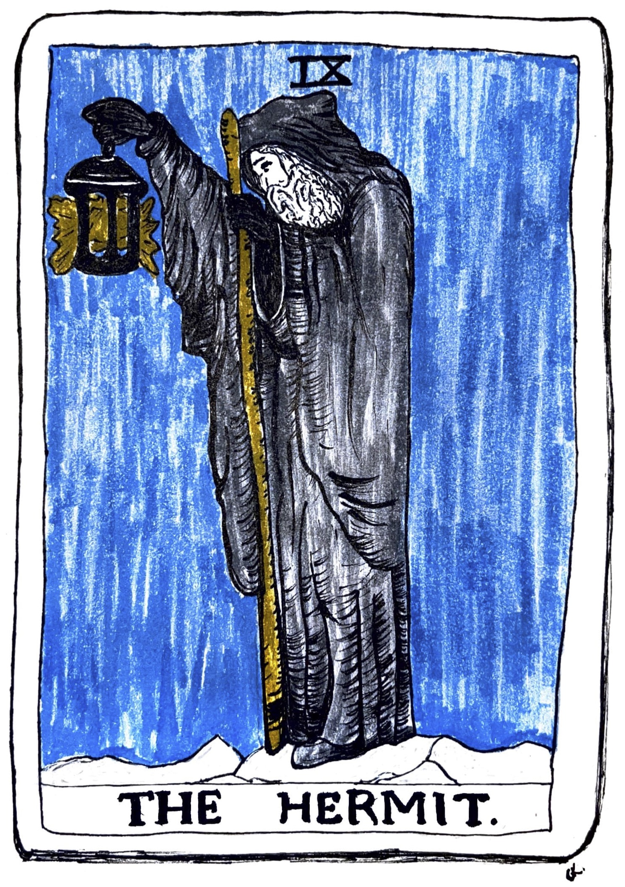

I don't know how many times I've heard this sentence during this journey: "Problems arise from the negative state of mind". 

I think my major problem was the failure to accept things how they are. Putting up with things, and trying not to control them. Realizing that we can only control our minds, and the real nature of a mind is peace were the first steps for me. I've been writing this post on a very long trip. When I arrived at the airport, I figured that a lot of transfer baggage have not arrived. There was a group of people arguing about what have happened. I thought that I would be one of them, trying to change the situation. I calmly went to the office and claimed my missing luggage, went out with a piece of paper in my pocket with the address of a friend. 

Believe me, we can't be bothered if our brain is patient. It doesn't mean that you shouldn't improve things if you can, but you can do it with a positive mind. Well, you can choose to leave uncomfortable situations too, but the key is to transform the mind. We tend to blame people and circumstances. Yes, we might be having hard times, but so does everyone. Changing work, partners, buying new things won't change our minds permanently. Also, trying to fix the people around us is a pointless toxic effort that harms us in the end. If we control our mind, we don't need to control our surroundings, right? 

Stress is just a response to the things happening, but the worries are unlimited. They can be realistic that is based on past experiences or unrealistic that are worst-case scenarios. They're the dark smoke in our lungs. To exhale them, we need to slow down our minds and observe where they come from. You just have to find the roots and triggers and overwrite them. Yes, the root is often childhood, genetics, or the social environment we were exposed to.

Anger is dangerous, often to the close ones. "It takes a spark to start a forest fire". You can destroy years-long relationships in five minutes. Isn't it self-sabotage? I think we have to acknowledge that anger not only harms others but also ourselves. It consumes a lot of energy that prevents manifesting positive things in our lives or showing our real potential. 

We weren't born as angry people, we become one. So, it is possible to control it. Negative habits do not change overnight, but there is a whole science and practical tool out there. If we don't fix it, we'll be temporarily patient when the triggers are not there, but it will come back or eat our brain silently.  

Past, future worries, belongings, and people in our minds are like bricks, we hold on to them and carry them everywhere. The first step, friends, is letting go of the attachments. We're living either in the past or future or trying to control present situations and people around us. We have unrealistic expectations from people and situations. We think that we will be in peace if they are fulfilled. 

We often pick up the small flaws and exaggerate them in our minds. We think everyone, everything is the worst; all the worst things happening to us; we are the victims; all world is against us. We forget to live the present moment which will never come back again. Imagine the joy you can have in one moment, solve a problem, a lyric that you can write, a smile you can make someone happy. 

Before the post gets too long, I want you to know that it is not permanent. All you want to do is change the fearful thought system which is the brain's coping mechanism into a new perspective that is based on inclusive love and kindness thought system. I was always anxious, in different ways and at different levels. I wholeheartedly wanted to change. My willingness and motivation got fired with a teaching community understanding me, meditating with them, and hours of inner work. It can happen real quick, and you'd be surprised with this new way of being and limitless potential. In the next post, I will write about the stages of this transformation. 

How can you navigate your emotions when you're grieving? Well, that is not easy, but the old fearful system also doesn't help you. Accept that you're responsible for your thoughts, stop blaming things and people, and let it go. Listen to your intuition/your higher self/your spirit. It will help you and guide you. It will speak calm and positive compared to your anxious mind. If you trust it, your mind won't go in thousands of other negative directions. If you feel alone, you're not. You're part of the universe. We are the ones. Be open to healing and meditate. 

