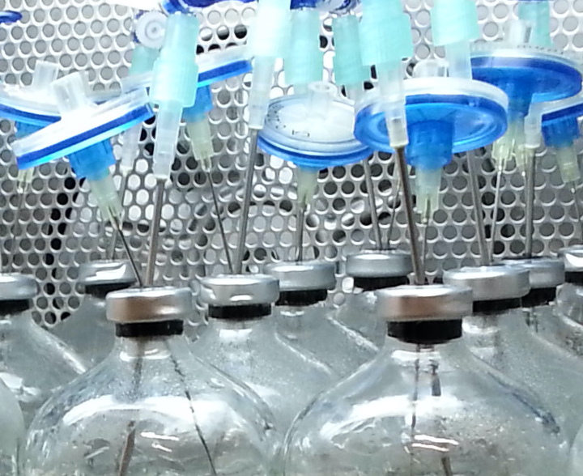
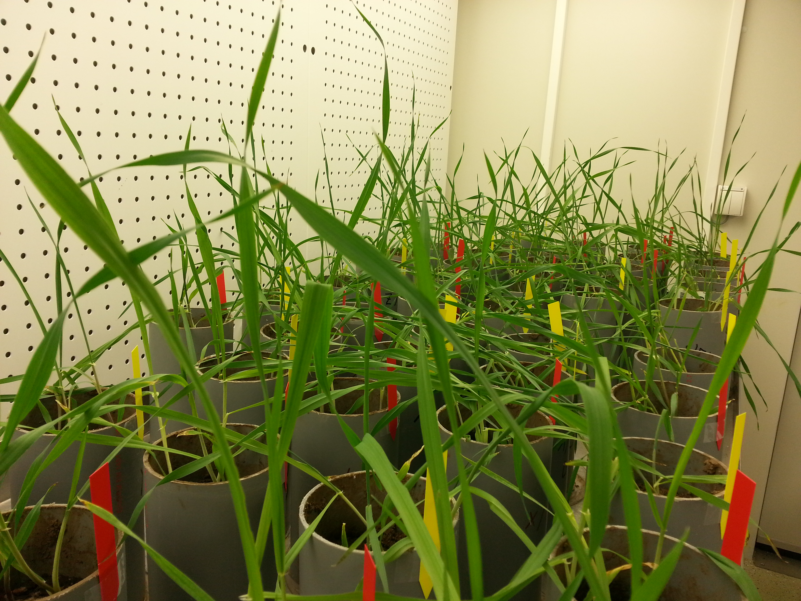

During my PhD and postdoc life at [UFZ](https://www.ufz.de/index.php?en=33573) and [iDiv](https://www.idiv.de/en/index.html), my research has mainly focused on the importance of species interactions, especially predator-prey interactions, and how the nature of perturbations shapes them. I have designed experiments with microcosms consisting of bacterial prey communities and the protozoan predator _Tetrahymena_. Some of the questions I have been asking were: How do population dynamics and inducible traits of species correspond to the diversity and coexistence of the communities? What mechanisms affect the dynamics, resistance, and recovery of species and communities? 

I also have worked with systems of different complexities. For example, we investigated the response of freshwater microbial biodiversity and functioning to nutrient elevations using semi-natural microcosms. 

We also investigated the role of aboveground and below-ground biodiversity and their interactions on the mitigation of drought stress using greenhouse pot experiments.

