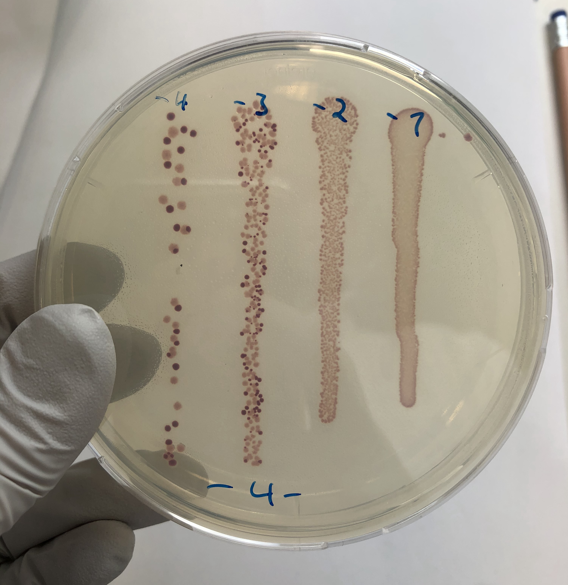

Abiotic and biotic interactions may constrain the evolution of traits. To test the effect of ecology on evolution, I have been observing host bacterial species co-evolving with their predator bacteriophage, competitors, and different selection pressures over generations. I have been especially simulate noisy antibiotic exposure or resource levels to understand the effect of environmental stochasticity on the population dynamics and the trait shifts. I have measured the shifts in life history and functional traits of the isolated focal species; have them compete with their ancestors, and we estimate their relative fitness.

